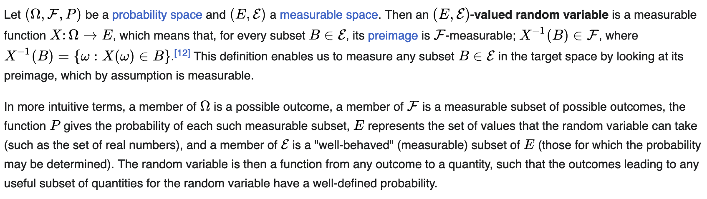

These are my informal notes on the master equation in mean field game theory, closely following the accessible sketch in [Delarue (2021)](https://www.ams.org/meetings/shortcourse/Delarue_AMS.pdf) with the same notation and supplemented when necessary.

See the reference for full details. All errors are mine.

## Part 2: differentiation on the space of probability measures

In this section we review probability spaces and measures, distance between measures, and recap differentiation wrt. probability measures can occur (following the Delarue notes). We also give some preliminaries on necessary concepts from measure theory and other fields when necessary.

### Review of probability spaces, measures and laws

A **probability space** is a tuple $(\Omega, \mathcal{F}, P)$.

- The first component $\Omega$ ("sample space") represents the set of all possible outcomes on the space.
- The second component $\mathcal{F}$ ("sigma-algebra") represents the collection of measurable subsets of $\Omega$.
  - It includes the entire set of outcomes $\Omega$.
  - It includes the empty set of no outcomes $\emptyset$.
  - It is closed under complementation: for $A \in \mathcal{F}$, then the complement is also included ($A^c \in \mathcal{F}$).
  - It is closed under countable unions: for disjoint events $A_1, A_2, \dots \in \mathcal{F}$, it follows $(A_1 \cup A_2 \cup \dots) \in \mathcal{F}$.
- The third component $P: \mathcal{F} \to [0,1]$, the **probability measure** is the measure assigned to every element of $\mathcal{F}$
  - It sums to one over the whole space ($P(\Omega)=1$) and zero over the empty set ($P(\emptyset)=0$).
  - It is countably additive: for disjoint events $A_1, A_2, \dots \in \mathcal{F}$, it follows $P(A_1 \cup A_2 \cup \dots) = \sum_i P(A_i)$.
  - Other properties: monotonicity, sub-additivity, etc.

For our application we focus on the reals, hence a random variable $X: \Omega \to \mathbb{R}^d$ represents the numeric realization of an outcome, where the realization is $P$-measurable. See [Wikipedia](https://en.wikipedia.org/wiki/Random_variable):

In our application we have the probability space $(\Omega, \mathcal{F}, P)$, and a random variable is given by $X: \Omega \to \underbrace{\mathbb{R}^d}_{E}$ with an associated sigma-algebra $\mathcal{E}$ on $E$. Usually this is the Borel sigma-algebra generated by all open sets on $\mathbb{R}^d$, and in practical terms means the smallest set that contains all possible intervals [(Wikipedia)](https://en.wikipedia.org/wiki/Borel_set).

Lastly, we define the **probability law** (probability distribution) as the probability measure on $X$'s space ($\mathbb{R}^d$) that describes the distribution of $X$'s values. Formally it is given by:
$$
\begin{align}
    \forall B \in \mathcal{E}: \mathcal{L}(X)(B) &= P(X^{-1}(B)) &\text{probability law of } X
\end{align}
$$
This says that for any realization of $X$ ($B \in \mathcal{E}$, e.g. some numbers in $\mathbb{R}^d$), it is $P$-measurable according to the original outcome space. Concisely, $\mathcal{L}(X)(B)$ gives the probability that $X$ takes a value in $B \subset E$.

Following the notes, we filter this down to the probability measures on $\mathbb{R}^d$ that have finite second moment. Denote this as the space of probability measures $\mathcal{P}_2(\mathbb{R}^d) := \{ \mu: \mathbb{R}^d \to [0,1], \int_{\mathbb{R}^d} \mu(s)^2 ds < \infty \}$.

### The Wasserstein distance between probability measures

How do we compare the "distance" between two probability distributions $\mu, \nu: \mathbb{R}^d \to [0,1]$? Note that we must account for both the "transport distance" (domain) as well as the "amount of mass to transport" (range) between these distributions. To measure this distance, we review the **[Wasserstein distance](https://en.wikipedia.org/wiki/Wasserstein_metric)** from optimal transportation.
$$
\begin{align}
    \forall \mu, \nu \in \mathbb{P}_2(\mathbb{R}^d)&: 
    W_2 (\mu, \nu) = \left[ \inf_{\pi} \int_{\mathbb{R}^d \times \mathbb{R}^d} |x-y|^2 d\pi(x,y) \right]^{1/2}
    &\text{2-Wasserstein distance}
\end{align}
$$
where the *coupling* $\pi(x,y): \mathbb{R}^d \times \mathbb{R}^d \to [0,1]$ is the joint probability measure between $\mu$ and $\nu$ on their joint image $\mathbb{R}^d \times \mathbb{R}^d$, and yielding the marginals in either factor. That is, for any measurable $A \subset \mathbb{R}^d$, we must have:
$$
\begin{align}
    \int_A \int_{\mathbb{R}^d} \pi(x,y) dy dx &= \mu(A) &\text{marginal } \mu \\
    \int_A \int_{\mathbb{R}^d} \pi(x,y) dx dy &= \nu(A) &\text{marginal } \nu
\end{align}
$$
For two random variables $X,X'$ with associated probability measures (laws) $\mu,\mu'$, the 2-Wasserstein distance is bounded above by the "root mean square distance" between the variables, according to their laws:
$$
\begin{align}
    W_2 (\mathcal{L}(X), \mathcal{L}(X')) \leq \mathbb{E}[|X - X'|^2]^{1/2}
\end{align}
$$
The exercise is given to show this bound for any two $N$-tuples $(x_1, \dots, x_N)$ and $(x_1', \dots, x_N')$ in $(\mathbb{R}^d)^N$:
$$
\begin{align}
    W_2 \left(
        \frac{1}{N}\sum_{i=1}^N \delta_{x_i}, 
        \frac{1}{N}\sum_{i=1}^N \delta_{x_i}'
    \right) &\leq \left(
        \frac{1}{N}\sum_{i=1}^N |x_i - x_i'|^2
    \right)^{1/2}
\end{align}
$$
The hint is to interpret this as two random variables $(x_\theta, x_\theta')$, whose probability laws are uniform measures on $(1 \dots N)$, aka the "empirical measure." To solve this, first connect the laws via the identity coupling $\pi(x,x') = \frac{1}{N}\sum_{i=1}^N \delta_{(x_i, x_i')}(x,x')$, which will have positive equal measure of $(1/N)$ only at the points $(x_i,x_i')_{i=1\dots N}$ and zero for any other $(x,x')$. Set up the transportation cost integral, noting that $(x_i,x_i')$ are not part of the integral:
$$
\begin{align}
    \int_{\mathbb{R}^d \times \mathbb{R}^d} |x-y|^2 d\pi(x,y) &=
        \int_{\mathbb{R}^d \times \mathbb{R}^d} |x-y|^2 \underbrace{d
            \left[\frac{1}{N}\sum_{i=1}^N \delta_{(x_i, x_i')}(x,y)\right]
        }_{\text{probability measure }\pi\text{ at }(x,y)} &\text{substitute the coupling} \\
        &= 
        \int_{\mathbb{R}^d \times \mathbb{R}^d} |x-y|^2
            \left[\frac{1}{N}\sum_{i=1}^N \mathbb{1}\left[(x_i,x_i')=(x,y)\right]\right] &\text{apply Dirac delta definition} \\
        &=
        \frac{1}{N} \sum_{i=1}^N |x_i-x_i'|^2 &\text{measure $1/N$ only at points } (x_i,x_i')_i \\
\end{align}
$$
Returning to the problem, let $(X_\theta, X_\theta')$ be two random variables $\Omega \to \mathbb{R}^d$ with the probability laws $(\frac{1}{N}\sum_{i=1}^N \delta_{x_i}, \frac{1}{N}\sum_{i=1}^N \delta_{x_i}')$ respectively. Noting the probability laws are in $\mathcal{P}_2(\mathbb{R}^d)$, it follows:
$$
\begin{align}
    W_2 \left(
        \underbrace{\frac{1}{N}\sum_{i=1}^N \delta_{x_i}}_{\mathcal{L}(x_\theta)},
        \underbrace{\frac{1}{N}\sum_{i=1}^N \delta_{x_i}'}_{\mathcal{L}(x_\theta')}
    \right) &= \left(
        \inf_\pi \int_{\mathbb{R}^d \times \mathbb{R}^d} |x - x'|^2 d\pi(x,x')
    \right)^{1/2} &\text{Wasserstein definition} \\
    &\leq \left( \int_{\mathbb{R}^d \times \mathbb{R}^d} |x - x'|^2 d\pi(x,x') \right)^{1/2} &\text{infimum + apply our specific coupling } \pi \\
    &= \left( \frac{1}{N} \sum_{i=1}^N |x_i - x_i'|^2 \right)^{1/2} &\text{apply the result}
\end{align}
$$
proving the result. $\square$

### Observation: the space of probability of measures is not flat!

In "flat" Euclidean spaces, the distance between two observations (points) is a straight line, and parallel lines do not intersect. However, now we are working in the space of probability measures, where "observations" are probability measures and "distance between observations" are the 2-Wasserstein distances. In this space, distances are no longer straightfoward, because they depend on the geometry of the distributions as well as the many possible couplings between them. For instance, if you were to construct a straight line correspondence between the supports of two probability distributions, this may no longer yield the shortest distance between them when weighted by the mass distributed at those locations.

Hence, when distances are no longer straightforward, traditional tools in differential and stochastic calculus may not apply easily.

### Differential calculus on Wasserstein probability space

Recall that our key challenge is to optimize the generalized value function $\mathcal{U}$ which requires taking derivatives wrt. the mean field flow $\mu \in \mathcal{P}_2(\mathbb{R}^d)$, in the space of probability measures.
$$
\begin{align}
    \mathcal{U}&: \mathcal{P}_2(\mathbb{R}^d) \to \mathbb{R}
\end{align}
$$
Differentiating with respect to this non-flat space is difficult. The idea of Lions' mean field game theory is to instead "lift" the generalized value function $\mathcal{U}$ onto an $L^2$ ([Hilbert](https://en.wikipedia.org/wiki/Lp_space)) space above the probability measures (as given in the notes).
$$
\begin{align}
    \mathcal{U}: L^2(\Omega, P) \in X &\mapsto \mathcal{U}(\mathcal{X}) &\text{the idea of Lions}
\end{align}
$$
and if we can show $\mathcal{U}$ is Frechet-differentiable, this implies $\mathcal{U}$ is differentiable.

### On the "lifting" idea

It is worth taking some time to understand this scheme.

First, Hilbert spaces are complete vector spaces with inner products. In short, completeness means that (Cauchy) sequences converge within the space; and inner products mean that distances, angles, orthogonality, and linear operations are well defined ([UC Davis](https://www.math.ucdavis.edu/~hunter/book/ch6.pdf)). This linear structure means that taking directional derivatives are well-defined and meaningful.

